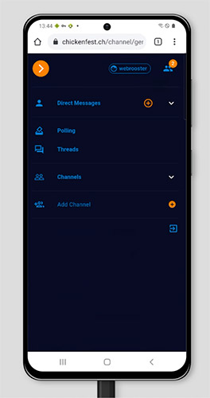
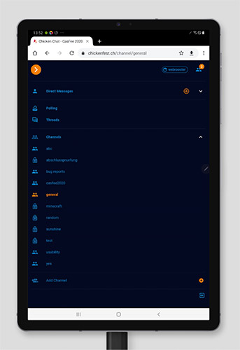
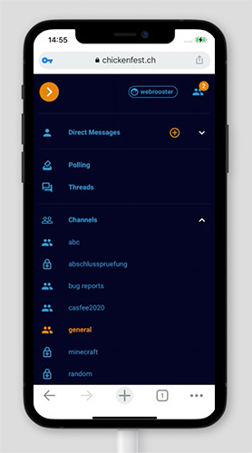
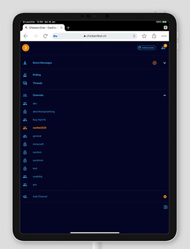

# Realtime Chat using GraphQL Subscriptions

This project is a realtime chat app that uses subscriptions in Hasura GraphQL Engine.
It is built using React, Apollo and Hasura with Postgres DB.

## Prerequisites for development

- Node (See `.nvmrc` for exact version or use `nvm use`)
- yarn
- Auth0 account, project and key (See: documentation/auth0.md)
- Docker & docker-compose
- [Hasura CLI v1.3.1](https://hasura.io/docs/1.0/graphql/core/hasura-cli/install-hasura-cli.html)

Please install hasura-cli version 1.3.1 or downgrade from higher version with following command

```shell script
hasura update-cli --version 1.3.1
```

## Usage

### Configuration

1. Copy `.env.dist` to `.env` and set all variables for your development environment.

### Installation

```shell script
# Clone repo
git clone https://github.com/tomschall/casfee2020-react-spa-ts.git
# Go to project directory
cd casfee2020-react-spa-ts
# Clone nestjs microservice for hasura actions
git clone https://github.com/tomschall/casfee2020-nestjs.git nestjs
```

If you just want to test the react app with an external API, go to [Development with external API](#development-with-external-api).

For development with local docker containers go to [Development with local API](#development-with-local-api).

For testing the rendered react app with local docker containers, follow next steps.

### Start docker containers

```shell script
# Start API inside Docker
docker-compose up -d
# cd to hasura folder
cd hasura
# apply migrations and metadata
yarn api:hasura:migrations:apply
```

### Users for login

For login take the following users, when you want to develop on local environment.

- email: webrooster@webrooster.ch (admin)
- email: kimi@gmail.com
- pw for all users: admin1234.$

* [Frontend](http://localhost)
* [Backend](http://localhost:8080/console)

## Usage development

### (#development-with-external-api)

If you want to use an external API, set all variables for your external API in your .env file.
Then start your react app. You don't need the docker containers. If they run, you can stop them.

```shell script
# install dependencies
yarn
# apply latest migrations and metadata and finally start app.
yarn dev:start
```

- [Frontend](http://localhost:3000)

### (#development-with-local-api)

If you want to use independent docker containers for development, start the docker containers.

```shell script
# Start API inside Docker
docker-compose up -d
# install dependencies
yarn
# apply latest migrations and metadata and finally start app.
yarn dev:start
```

- [Frontend](http://localhost:3000)

### Start Hasura Console

If you want to add tables or metadata, please use hasura console, changes will be tracked automatically:

```shell script
yarn api:hasura:console
```

### Export metadata and migrations manually

In the project root folder delete hasura folder, the run following commands

```shell script
hasura init
cd hasura
hasura migrate create casfee2020-react-spa-ts --from-server --endpoint http://localhost:8080 --admin-secret supersecret
hasura metadata export --endpoint http://localhost:8080 --admin-secret supersecret
```

### Generate TS types and React hooks

```shell script
npm run api:client:generate
```

## Troubleshooting

### Complete reinstall

If your docker containers are running, and you have to reinstall the whole project, stop
them, then execute ./clean.sh script in the root folder of the project.

## Tests

### Unit tests

For running unit tests, use following command in the project root.

```
yarn test
```

### E2E-Tests with nightwatch

Update your nightwatch test user in nightwatch.conf.js accordingly.

### E2E-Tests (local)

```
npx nightwatch nightwatch
```

### E2E-Tests (https://chickenfest.ch)

```
npx nightwatch nightwatch --env production
```

## Extras

- Typing indicator
- Number of users are online
- Direct message users online status
- Inline edit your own chat- and direct messages
- When a message with a thread get's deleted, there's an additonal info on the message and the thread gets not deleted
- Add giphy's to your chat and direct messages
- Add default message to your channel on creation
- Show number of new messages in sidebar - for this feature the user must have visited the channel at least once, thread messages are not counted at the moment
- Generate a thread on each message.
- Listing all generated threads in one list.
- Admin dashboard to generate user pollings. Publish a poll on one or more public channels. The User has to be administrator to administrate pollings.
- Unit Tests with react-tesing-library
- End To End Tests with nightwatch
- Usability Tests
- We also tested the app with browserstack emulator and on real smartphones with iOS and Android

## Browserstack Android Testings

<p align="center">
  
  
</p>

## Browserstack iPhone Testings

<p align="center">
  
  
</p>

## Demo Chatapp

URL: https://chickenfest.ch
